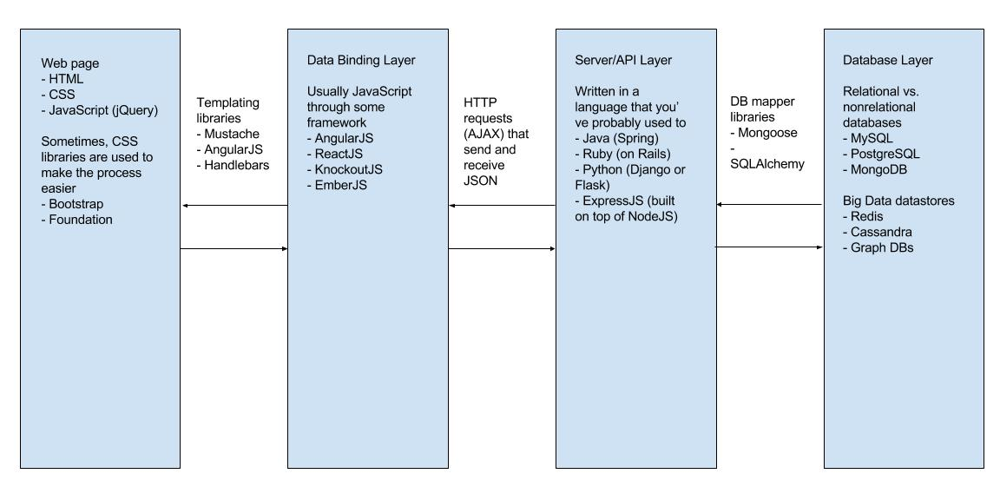

# Web Introduction Tutorial Notes

## A High-Level Overview of How Websites Are Built

Websites and web applications are becoming increasingly sophisticated and complex. The architecture has certainly evolved since the first websites were built way back when the Internet started. Now, it is the source of so many businesses today: Google, Facebook, Twitter, eBay, PayPal, Etsy, Amazon, etc.

The current accepted architecture paradigm is the idea of client-side vs. server-side. Client-side means that the client (usually the user) can see and interact with the website. It affects the user interface (what the user sees) and the user experience (what the user experiences through manipulating different parts of the website or web app). Server-side means that there is business logic unknown to the client that handles transactions as a result of client interactions.

Client-side programming is also known as front-end programming. Server-side programming is known as back-end programming. Sometimes, for a person who knows a bit about both, we say that that person knows full-stack web programming.

A disclaimer: We will use the term websites and web applications often interchangeably. The two have increasingly started to meld together. Historically, websites often described static web pages, pages with no server-side programming is required to serve additional business logic other than just serving the web page itself. Web applications describe interactive web pages in which server-side programming is required to handle business logic.



For the first tutorial, we will focus on the first box, the client-side box, because that is the most visual of all of the steps. As you move farther down the box, you can think of yourself moving farther back in the stack. So we'll start off with front-end programming and slowly move our way back.

## HTML - Hypertext Markup Language

When the web was first developed, there was a need to have a set of semantic rules to present content in consistent ways. Tim Berners-Lee, the creator of the Internet, wanted to specify a standardized way of putting information on a distributed network to be shared. After all, the Internet was first a concept in the scientific community to share papers and findings. Consistency was the only way to go if the Internet were to be maintainable (at that time) and scale up to many, many users. Thus, HTML was born.

HTML (Hypertext Markup Language) requires tags to specify how content is to be displayed. A starting and ending tag enclose a piece of content, giving indication to the browser to display this piece of content a certain way.

A tag can have attributes associated to it. Tags can be nested within each other to indicate precedence in rendering.

For instance, to render a paragraph, we type `<p>Paragraph text here</p>`.

So lines and lines of text and nested tags together make up an HTML document, which is then rendered line-by-line by the browser to load the web page.

HTML has had a 20+ year history of being developed and iterated on, including switching organizations of who manage its standards and its development. The most recent version of HTML is HTML5.

You'll often hear the term semantic tags thrown around, or components. We will discuss this in more detail as tutorials progress, but this is simply in reference to having tags reflect what was originally seen as article or page layout components in traditional print and newspapers.

## CSS - Cascading Style Sheet

Originally, Tim Berners-Lee's vision for the Internet was to be able to share documents easily amongst scientists at CERN. Paper was hugely inefficient and costly. Everyone had a screen attached to their computer for computations. Why not display shared information on that screen as well?

Many original websites would therefore only use plain HTML files to display their content. It was enough to just have the text written out and for the reader to see a white page with black Times New Roman font.

The development of the World Wide Web expanded this information-sharing to the rest of the world, not just scientists. There became a need for pictures, videos, etc. Media in general.

There also grew a need to be able to format content in different ways. Hence, CSS was born.

CSS (Cascading Style Sheets) utilizes the HTML tags, id attributes, class attributes (and more complicated identifying features of HTML elements) and sets up some rules for the formatting of the content of and within that specific HTML element.

Example CSS looks like so.

```css
p {
    color: red;
    font-size: 14px;
}
```

In this example, I specify that all p elements (which are paragraphs) have text be the color red and 14px large.

CSS allows for a lot of customization in the look and feel of your site. You can change fonts, borders, measurements, etc. Now, with CSS3, the most recent version, you have the capability to draw and specify shapes, gradients, curves, animations, etc.

## Javascript

At first, websites were mostly for just reading and information sharing. However, people then realized that this is software. As a Dropbox Director of Engineering once told me, "Once you know how a system works and its rules, you then realize that you can change the rules." So people started changing the rules about how they viewed and used the Internet. They wanted websites that not only looked pretty, but also were interactive as well. They wanted to collect information from the people who used their website.

In comes Javascript. The language was built in 10 days by Brandan Eich, a UIUC alum who was working at Netscape at the time, an early Internet browser.

While you might see some similarities to Java, a programming language that many beginners start out learning, especially in regards to object-oriented programming, Javascript is entirely different and not related at all to Java.

The most common use case for Javascript is to manipulate what we call the DOM, or Document Object Model, the underlying mechanism that describes the structure of a website's HTML. Javascript can be used to provide animations and other time-based layout changes to websites. It also is used to react to user interactions on websites (in particular, when you press a button or drag a file to upload for instance).

Javascript is rapidly becoming a very popular language to program in. Later in these tutorials, we will explore Javascript frameworks that do more than just make a website interactive. Javascript is used to handle data requests and responses between servers and clients. Javascript can be used as wrappers to pure database querying languages. Javascript is becoming quite ubiquitous when it comes to web programming. Almost all aspects of modern web development deal with Javascript in some way.

## Common Frameworks

From the first tutorial, you might've gotten the sense that web programming can be quite tedious at times, especially CSS. Over the course of the modern Internet, web developers realized that there was a need to speed up common processes and perhaps give some common styling to commonly seen web components (like buttons for instance).

In come frameworks. Frameworks are pieces of code that dictate the architecture of a piece of software. In the context of web programming, frameworks dictate the styling and the programming of interactions for our websites.

CSS has many frameworks, all of which are unique in some sense of providing out-of-the-box solutions for commonly seen web components (like buttons, form fields, the like). Bootstrap is one such framework. It was inspired by Twitter's user interface design. It provides a lot of the styling for you so that you can go ahead and just concentrate on building the web page based on how you like it be built. Any changes to the UI you'd like to make with these frameworks would be lower cost in terms of work because a lot of the default is already done for you. Minor tweaks can lead to big changes. More examples of frameworks are given in the slides.

Javascript has a plethora of frameworks, like we mentioned above. We'll go more into detail in the later tutorials.

Another area that has been exploding in popularity of frameworks is fonts and icons (or icon fonts :O ). It used to be that if you wanted to use a custom font instead of the default built-in ones (like Arial, Helvetica, etc. your standard Microsoft Office fonts), you had to download 5 different font files to account for the multitude of web browsers there were. Then, you had to create a font-family that linked all of those files together and gave that font-family a name. Quite tedious if you had multiple fonts you'd want to use. Now, there's a lot of frameworks out there that provide you these fonts and icons out of the box. All you have to do is link to them.

The linking that we've done in the tutorial to various fonts / frameworks is an example of using a Content Delivery Network (CDN). CDNs live in the cloud and serve outside assets to a certain webpage whenever they make a request for it. This is better for performance and doesn't require you to download these frameworks themselves (whose files might be massive).

**TODO: Write about second tutorial**